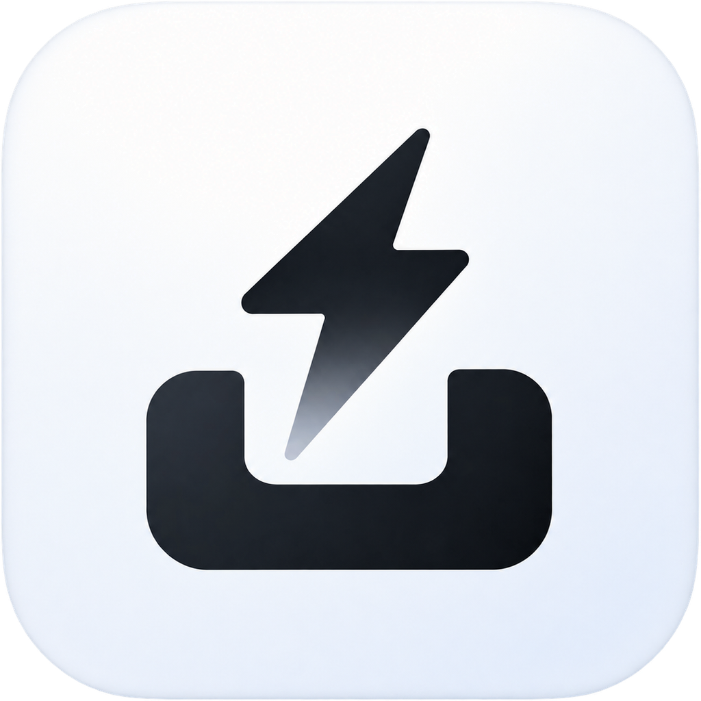
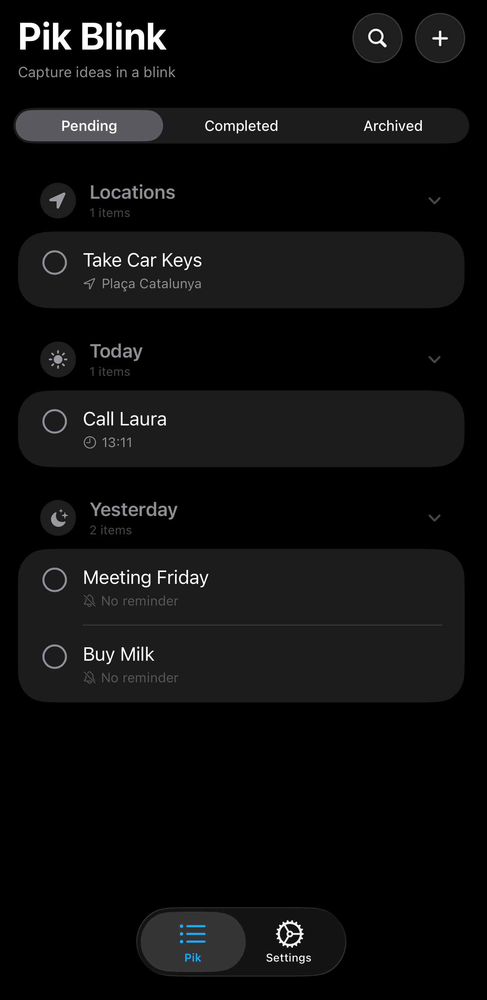

# ⚡ Pik Blink

  

  <strong>Capture ideas in a blink.</strong>

  A beautifully native reminder app built with SwiftUI, Widgets, Dynamic Island and Live Activities.

  
  
  
  

---

## ✨ Overview

**Pik Blink** is a native productivity app designed around one simple idea:

> The faster an idea is captured, the less likely it is to be forgotten.

Create reminders in seconds, receive notifications based on **time** or **location**, and keep everything synchronized across Widgets, Dynamic Island and Live Activities.

---

## Features

- 📝 One-tap idea capture
- ⏰ Time reminders
- 📍 Location reminders
- 🔔 Local notifications
- 🟢 Dynamic Island
- 🎯 Live Activities
- 🧩 Home Screen widgets
- 🌍 English · Español · Català
- 💎 Liquid Glass inspired design

---

# 📱 Screenshots

## Home

  

## Smart reminders

  
  

Choose **when** or **where** you want to be reminded in just one tap.

---

## Widgets

### Small Widget

  

### Medium Widget

  

### Large Widget

  

Your most important reminders are always visible directly from the Home Screen.

---

## Dynamic Island & Live Activities

  
  

### Empty state

  

Live Activities automatically appear before reminders and stay perfectly integrated with iOS.

---

# 🏗 Built With

| Technology | Purpose |
|------------|---------|
| **SwiftUI** | Native user interface |
| **SwiftData** | Local persistence |
| **WidgetKit** | Home Screen widgets |
| **ActivityKit** | Dynamic Island & Live Activities |
| **App Intents** | Quick capture & Siri integration |
| **UserNotifications** | Local reminders |
| **CoreLocation** | Geofenced reminders |

---

# 🚀 Roadmap

- [x] SwiftData architecture
- [x] Widgets (Small · Medium · Large)
- [x] Dynamic Island
- [x] Live Activities
- [x] Time reminders
- [x] Location reminders
- [ ] Interactive Live Activities
- [ ] Apple Watch app
- [ ] iCloud Sync

---

## Philosophy

Pik Blink follows Apple's Human Interface Guidelines by prioritizing:

- **Zero-friction capture**
- **Native interactions**
- **Privacy-first local storage**
- **Beautiful glanceable information**

Everything happens on-device whenever possible.

---

  Made with ❤️ in Barcelona using Swift

